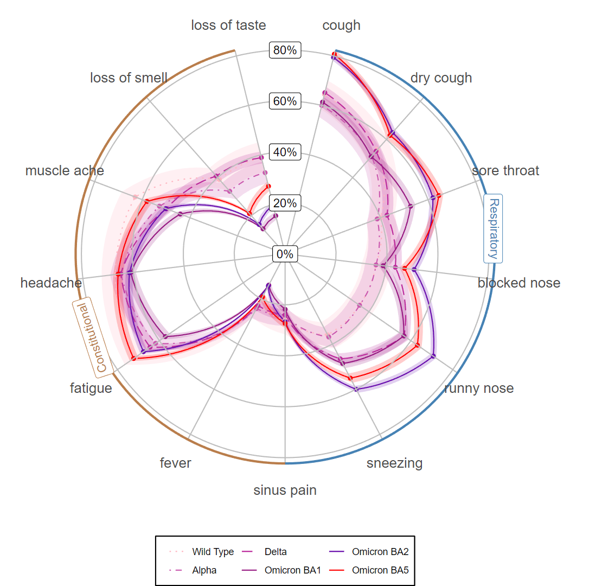

 

-   ***How does the SARS-CoV-2 symptom profile compare to other respiratory infections? And how does the SARS-CoV-2 symptomatology evolves as new variants emerge?***

This study describes and compares the proportion of symptoms reported during illnesses infected by common respiratory viruses. The SARS-CoV-2 symptom profile increasingly resembles that of other respiratory viruses as new strains emerge. Increased cough, sore throat, runny nose, and sneezing are associated with the emergence of the Omicron strains. As SARS-CoV-2 becomes endemic, monitoring the evolution of its symptomatology associated with new variants will be critical for clinical surveillance.

 

 

**Research paper:** [Symptom profiles of community cases infected by Influenza, RSV, rhinovirus, seasonal coronavirus, and SARS-CoV-2 variants of concern](https://www.researchsquare.com/article/rs-2402048/v1)

  

-   ***Which symptoms are more common in COVID-19 compared to other infections, and can we tell whether an illness is COVID-19 based on symptoms alone?***

In our study, high temperature and a change in taste or smell were more likely in COVID-19 than in other infections. However, the most common symptoms of COVID-19 were general symptoms such as cough, headache, feeling tired, muscle aches, and loss of appetite. These general symptoms were also very common in other illnesses. Because the most common symptoms of COVID-19 are also often seen in other infections, it is difficult to tell apart from other infections and common illnesses based on symptoms alone.

**Research paper:** [Symptom profiles and accuracy of clinical case definitions for COVID-19 in a community cohort: results from the Virus Watch cohort](https://wellcomeopenresearch.org/articles/7-84/v1)
