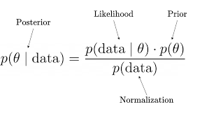

*A short step by step exercise to write a Bayesian Model using a MCMC algorithm in `R` & `C++`.*

------------------------------------------------------------------------

<style>
body {
text-align: justify}
</style>

# Concepts

**Dear Prof.[ChatGPT](https://openai.com/blog/chatgpt/) …**

1.  **What’s the likelihood ?**

In probability and statistics, **likelihood** is a measure of how probable it is that a set of observations or data could have been generated by a given set of underlying model assumptions. It is typically used to evaluate the fit of a statistical model to a set of data or to compare the fit of different models to the same data. The likelihood function is a function that expresses the probability of a set of observations given a set of model parameters. It is used to assess the goodness-of-fit of a statistical model by comparing the observed data with the data that would be expected under the model. Maximum likelihood estimation is a method of estimating the parameters of a statistical model by finding the values that maximize the likelihood function.

2.  **What’s a prior?**

In probability and statistics, a **prior** is a probability distribution that reflects the initial state of knowledge about a random event or variable. It represents the information and beliefs that are available before any additional data are collected or analyzed. A prior is used to express the uncertainty associated with a random event or variable, and to make predictions or decisions based on this uncertainty.

3.  **How do those fit into Bayes Theorem?**

In Bayesian analysis, a prior is used in conjunction with Bayes’ theorem to update the probability of an event based on new information. The prior is combined with the likelihood of the new data to calculate the posterior probability of the event, which represents the **updated state of knowledge about the event**.

**For example**, imagine you are trying to **estimate the probability that a person has a certain medical condition based on their test result**. The test is not 100% accurate, so there is a chance that it will give a false positive (i.e., the test says the person has the condition, but they actually do not) or a false negative (i.e., the test says the person does not have the condition, but they actually do). The **prior** in this case would be **the initial probability that the person has the condition**, based on factors such as their age, gender, and other risk factors. The **likelihood** would be the **probability of the test result given the person’s condition**. The **posterior** probability would be the updated **probability that the person has the condition, based on the prior and the likelihood**.

<center>



</center>
4.  **How do you write a Bayesian Model?**

To write a Bayesian model, you need to specify the following components:

1.  A likelihood function: This describes the probability of the data given the model parameters.

2.  Prior distributions: These represent our prior beliefs about the model parameters.

3.  A posterior distribution: This is the distribution of the model parameters given the data, which is obtained using Bayes’ theorem by combining the likelihood function and the prior distributions.

To specify the likelihood function and prior distributions, you need to choose a parametric form for each. Common choices for the likelihood function include the normal distribution, the binomial distribution, and the Poisson distribution, among others. For the prior distributions, common choices include the uniform distribution, the normal distribution, and the gamma distribution.

Once you have specified the likelihood function and prior distributions, you can use Bayes’ theorem to compute the posterior distribution:

posterior = (likelihood x prior) / normalizing constant

The normalizing constant is a term that ensures that the posterior distribution is properly normalized, i.e., that it integrates to 1 over the entire parameter space.

5.  **What’s a MCMC algorithm ?**

Markov chain Monte Carlo (MCMC) is a class of algorithms that can be used to **estimate the posterior distribution of a Bayesian model**. MCMC algorithms work by **iteratively sampling from the posterior** distribution and using the samples to **estimate** the desired parameters of the model (e.g. mean & variance).

So, MCMC is a way to **approximate the posterior distribution** of a Bayesian model and **make inferences about the model parameters**. It is a useful tool for Bayesian modeling because it allows us to perform Bayesian inference on complex models that may not have an analytic solution for the posterior distribution.

6.  **How do you build a MCMC algorithm?**

<!-- -->

1.  Specify the **target** distribution: The first step in using an MCMC algorithm is to specify the distribution that you want to sample from. This is known as the target distribution. The target distribution can be any probability distribution, and it is often a complex distribution that cannot be directly evaluated or sampled from.
2.  Choose a **proposal** distribution: The next step is to choose a proposal distribution, which is a distribution that is used to generate new samples for the Markov chain. The proposal distribution should be easy to sample from and should have a relatively high probability of generating samples that are close to the current state of the chain.
3.  **Initialize** the Markov chain: The Markov chain is initialized by choosing an initial state for the chain. This initial state is called the starting point or the burn-in period. The choice of starting point can have an impact on the convergence of the chain, so it is important to choose an appropriate starting point.
4.  **Iterate** through the Markov chain: At each iteration of the chain, a new sample is generated from the proposal distribution, and the acceptance probability of the sample is calculated. The acceptance probability is based on the ratio of the target distribution to the proposal distribution at the current state and the proposed new state. If the acceptance probability is greater than a randomly chosen value between 0 and 1, then the sample is accepted and the chain moves to the new state. If the acceptance probability is less than the randomly chosen value, then the sample is rejected and the chain remains at the current state.
5.  **Collect** samples from the chain: After the chain has converged to its stationary distribution, samples can be collected from the chain and used to approximate the target distribution. The samples collected from the chain are correlated, so it is often necessary to **thin the chain** or **use a burn-in** **period** to obtain a set of independent samples.

<center>
*Let’s try to build our model & the MCMC, step by step.*
</center>

<br><br>

# The Problem

We received data about the rate of introduction of a given pathogen. We want to use a MCMC to estimate the parameters of a model that describes the data we observe.

## Simulate the Data

First we define the underlying parameters generating the data.

``` r
true_mu = 2.14
true_sd = 0.12
```

``` r
data <- rgamma(1000, shape=(true_mu/true_sd)^2, scale = true_sd^2/true_mu)
```

We say that *“the data is gamma distributed with a mean of 2.14 and a standard deviation of 0.12”* <br> ➡️ <span style="color:blue">**Our goal is to find out those two parameters.**</span>

Note that we express `shape` and `scale` using mean and standard deviation as it is simpler to calculate. Check out `epitrix::gamma_mucv2shapescale()`.$$meanGamma = shape * scale$$

## View the Data

We plot the `data` below:

}}index_files/figure-html/plot the data-1.png" width="672" style="display: block; margin: auto;" />

# Define the model

Note we are working on the log scale to make computations easier. **On the log scale, the most probable is the closest to 0**, the least probable closest to -$\infty$.

## Prior

- How I think the **mean** (`mu`) is distributed:

``` r
prior_mu = 5 # I think that on average the introduction rate is 5%
prior_sd = 1 # How I think the above is dispersed 
```

``` r
log_prior_mu <- function(mu, prior_mu, prior_sd) {
  if(mu<0){
    return (-Inf)
  } 
  else{
    return( dnorm(mu, mean = prior_mu, sd = prior_sd, log=TRUE) )
  }
}
```

}}index_files/figure-html/plot log_prior_mu-1.png" width="672" style="display: block; margin: auto;" />

- How I think the **standard deviation** (`sd`) is distributed:

Here, we refer the the sd of the gamma distribution, not the sd of the mean as above.

``` r
log_prior_sd <- function(sd)
{
	return( dexp(sd, rate=1/1000 , log=TRUE) )
}
```

Say I have no prior knowledge about the sd, I use a flat exponential prior so that it returns a quasi flat line from 0 to infinity.

}}index_files/figure-html/plot log_prior_sd-1.png" width="672" style="display: block; margin: auto;" />

- The total prior function is the combination of the 2 prior functions above:

``` r
log_prior_total <- function(mu, sd, prior_mu, prior_sd)
{
  return(log_prior_mu(mu, prior_mu, prior_sd) + log_prior_sd(sd))
}
```

}}index_files/figure-html/plot log_prior_total-1.png" width="672" style="display: block; margin: auto;" />

*The most probable prior zone is when `mu` is around 5, the `sd` doesn’t matter (that’s because we used an uninformative/flat prior for the `sd`)*

## Likelihood

The probability of the data given our model/parameters.

``` r
log_likelihood <- function(dat, mu, sd)
{
  if (mu <= 0) {
    return(-Inf)
  }
  return( sum(  dgamma(dat, shape=(mu/sd)^2, scale = sd^2/mu, log = TRUE) ) )
  
}
```

}}index_files/figure-html/plot log_likelihood-1.png" width="672" style="display: block; margin: auto;" />

We see that the region with highest likelihood is when mu \~2.

## Posterior

``` r
log_posterior <- function(dat, mu, sd, prior_mu, prior_sd)
{
  return( log_likelihood(dat, mu, sd) + log_prior_total(mu, sd, prior_mu, prior_sd) ) 
}
```

}}index_files/figure-html/plot log_posterior-1.png" width="672" style="display: block; margin: auto;" />

In this case, `prior_mu` and `prior_sd` are the **mean** and **standard deviation** of the **prior distribution for the parameter mu**. This prior distribution represents the initial state of knowledge about the value of mu before any data are collected or analysed.

- `mu` is a parameter in the statistical model being considered. It represents the **mean of the underlying distribution that is being fit to the data.**

- `sd` is also a parameter in the statistical model and represents **the standard deviation of the underlying distribution being fit to the data**. It is the measure of dispersion or spread of the distribution.

TL;DR:

- `prior_mu`: the mean of the prior distribution for the parameter `mu`

- `prior_sd`: the standard deviation of the prior distribution for the parameter mu

- `mu`: the underlying mean for the target distribution

- `sd`: the underlying standard deviation for the target distribution

# MCMC with C++

A MCMC can be computationally intensive. C++ is a compiled language, while R is an interpreted language, so C++ code tends to be faster than R code. Additionally, C++ has a more efficient memory management system and a lower level of abstraction than R, which can also contribute to better performance.

Clear up your environment from the R functions and load the `Rcpp` package:

``` r
rm(list = ls(pattern = "^log"))
library(Rcpp)
```

Store `.cpp` and `.h` files below in a folder called *cpp_files.*

## Model

Let’s now write our model in C++ using the Rcpp package.

### `cpp_model.cpp`

*Note we only export the `log_posterior` function since that’s the only one we will call in our MCMC.*

``` cpp
//https://teuder.github.io/rcpp4everyone_en/220_dpqr_functions.html

#include <Rcpp.h>

using namespace Rcpp;

//LIKELIHOOD

// [[Rcpp::export]]
double log_likelihood(NumericVector dat, double mu, double sd) 
{
  if(mu<=0){
    return (R_NegInf);
  } else{
    return sum(Rcpp::dgamma(dat, std::pow(mu/sd, 2), std::pow(sd, 2) / mu, true ));
  }
}


//PRIOR

double log_prior_mu(double mu, double prior_mu, double prior_sd) 
{
  if(mu<0){
    return (R_NegInf);
  } // The function returns a probability of 0 if the mean is negative
  else{
    return R::dnorm(mu, prior_mu, prior_sd, TRUE); 
  }
}


double log_prior_sd(double sd){
  return R::dexp(sd, 1.0/1000.0, TRUE);
}

double log_prior_total(double mu, double sd, double prior_mu, double prior_sd)
{
  return (log_prior_mu(mu, prior_mu, prior_sd) + log_prior_sd(sd));
}

// POSTERIOR
// [[Rcpp::export]]
double log_posterior(Rcpp::NumericVector dat, double mu, double sd, double prior_mu, double prior_sd)
{
  return( log_likelihood(dat, mu, sd) + log_prior_total(mu, sd, prior_mu, prior_sd) );
}
```

### `cpp_model.h`

*The below is a “header file”, you need it to call the created functions into another cpp function.*

``` cpp

#ifndef CPP_MODEL_H
#define CPP_MODEL_H

#include <Rcpp.h>

using namespace Rcpp;

double log_likelihood(NumericVector dat, double mu, double sd);
double log_prior_mu(double mu, double prior_mu, double prior_sd);
double log_prior_sd(double sd);
double log_prior_total(double mu, double sd, double prior_mu, double prior_sd);
double log_posterior(Rcpp::NumericVector dat, double mu, double sd, double prior_mu, double prior_sd);

#endif
```

## Movement Functions

Let’s write our movement function for the **markov chain**. Movement functions update the value of the parameters (`mu`/`sd`) as we explore the posterior distributions in the MCMC.

### `Move.cpp`

In the **`move_param()`** function below, the parameter being proposed for a move is determined by the `moving` argument, which is a string that can take the values “mu” or “sd” representing the mean or standard deviation respectively. `curr_param` is the current value of the parameter that is being proposed for a move in the MCMC algorithm, while `fixed_param` is the value of the other parameter that is not being proposed for a move. If `moving` is “mu”, then `curr_param` is the current value of the **mean** and `fixed_param` is the current value of the **standard deviation**. Similarly, if `moving` is “sd”, then `curr_param` is the current value of the **standard deviation** and `fixed_param` is the current value of the **mean**.

The `log_posterior()` function is called to compute the ratio of the posterior probabilities of the **new and current values of the parameter**. The ratio of the posterior probabilities is then used to determine whether to accept or reject the proposed move. If the proposed move is accepted, `curr_param` is updated with the **new value**, otherwise the current value is retained.

``` cpp

#include <Rcpp.h>
#include "cpp_model.h"
using namespace Rcpp;

// [[Rcpp::export]]
Rcpp::List move_param(std::string moving,
                      double curr_param,
                      double fixed_param,
                      double sd_proposal,
                      Rcpp::NumericVector dat,
                      double prior_mu,
                      double prior_sd) 
{
  
  // printing info
  Rcpp::Rcout << "moving " << moving << std::endl;
  Rcpp::Rcout << "curr_param: " << curr_param << std::endl;
  Rcpp::Rcout << "fixed_param: " << fixed_param << std::endl;
  
  
  // Sample a new value for the parameter from a normal distribution with mean equal to the current parameter value and standard deviation equal to sd_proposal
  double new_param = R::rnorm(curr_param, sd_proposal);
  
  // Print out the new value of the parameter
  Rcpp::Rcout << "new_param: " << new_param << std::endl;
  
  // Declare ratio_post outside if{} statement to compile
  double ratio_post;
  
  // Calculate the ratio of the posterior probabilities for the new and current values of the parameter
  if(moving == "mu"){
    
    ratio_post = log_posterior(dat, new_param, fixed_param, prior_mu, prior_sd) - log_posterior(dat, curr_param, fixed_param, prior_mu, prior_sd);
    
  } else if(moving == "sd") {
    
    ratio_post = log_posterior(dat, fixed_param, new_param, prior_mu, prior_sd) - log_posterior(dat, fixed_param, curr_param, prior_mu, prior_sd);
    
  }else{
    
    ratio_post = R_NegInf;
    
  }
  
  // Initialize the correction term to 0 (0 because our proposal distribution is symetrical)
  double correction = 0.0;
  
  // Calculate the acceptance probability for the new value of the parameter  
  double p_accept = ratio_post + correction;
  Rcpp::Rcout << "p_accept: " << p_accept << std::endl;
  
  // Sample a uniform random value between 0 and 1
  double tmp = log(Rcpp::runif(1)[0]);
  
  // If the random value is less than the acceptance probability, accept the new value of the parameter   
  double updated_param;
  double accept;
  if(tmp < p_accept) 
  {
    updated_param = new_param;
    accept = 1;
    Rcpp::Rcout << "accept" << std::endl << std::endl;
    
  }else // reject
  {
    updated_param = curr_param; 
    accept = 0;
    Rcpp::Rcout << "reject" << std::endl << std::endl;
  }
  
  // Return a List containing the updated value of the parameter and a binary value indicating whether the new value was accepted or rejected
  return Rcpp::List::create(Rcpp::Named("updated_param") = updated_param,
                            Rcpp::Named("accept") = accept);
}
```

This function implements the Metropolis-Hastings algorithm for the parameter `\(\theta\)` (`mu` or `sd`). The algorithm works as follows:

1.  A proposal for a new value of `\(\theta\)` is generated from a normal distribution with mean equal to the current value of the parameter (`curr_param`) and standard deviation equal to `sd_proposal`.

2.  The posterior probability of the data given the current and proposed values of `\(\theta\)` are calculated using the `log_posterior()` function which combines the likelihood (calculated using the `log_likelihood()` function) and the prior (calculated using the `log_prior_total()` function).

3.  A `correction` term is added to the ratio of the posterior probabilities. This term is typically used to correct for asymmetry in the proposal distribution. In this case, the correction is set to zero since the proposal distribution is symmetrical (normal).

4.  The acceptance probability, `p_accept`, is calculated as the sum of the ratio of the posterior probabilities and the correction term.

5.  A random uniform value between 0 and 1 is generated (`tmp`) and compared to the acceptance probability. If the uniform value is less than the acceptance probability, the proposed value of `\(\theta\)` is accepted and becomes the updated value. Otherwise, the current value is retained.

6.  The updated value of `\(\theta\)` and a binary indicator of acceptance (1 if accepted, 0 if rejected) are returned.

### `Move.h`

Now store the header file in your main directory.

``` cpp

#ifndef MOVE_H
#define MOVE_H

#include <Rcpp.h>

using namespace Rcpp;

List move_param(std::string moving, double curr_param, double fixed_param, double sd_proposal, Rcpp::NumericVector dat, double prior_mu, double prior_sd);

#endif
```

## The Algorithm

Now that our movement function is defined, we can create a for loop that will move each parameter over a defined number of iterations. That’s the MCMC.

### `mcmc.cpp`

``` cpp
#include <Rcpp.h>
#include "cpp_model.h"
#include "move.h"
using namespace Rcpp;

// [[Rcpp::export]]
Rcpp::DataFrame mcmc(int n_iter, 
                     double init_mu, 
                     double init_sd, 
                     double sd_proposal_mu,
                     double sd_proposal_sd,
                     Rcpp::NumericVector data, 
                     double prior_mu, 
                     double prior_sd )
{
  
  // Vectors to store the chain of explored parameters & initialize the first elements of the chains with the provided initial values
  NumericVector mu_chain(n_iter);
  mu_chain[0] = init_mu;
  NumericVector sd_chain(n_iter);
  sd_chain[0] = init_sd;
  
  // Log-likelihoods
  NumericVector loglike_chain(n_iter);
  loglike_chain[0] = log_likelihood(data, mu_chain[0], sd_chain[0]);
  
  //Log-posterior
  NumericVector logpost_chain(n_iter);
  logpost_chain[0] = log_posterior(data, mu_chain[0],sd_chain[0],prior_mu, prior_sd);
  
  //Log-prior
  NumericVector logprior_chain(n_iter);
  logprior_chain[0] = log_prior_total(mu_chain[0], sd_chain[0], prior_mu, prior_sd);
  
  
  // Vectors to store the acceptance rate for the mu and sd parameters
  NumericVector accept_mu(n_iter);
  NumericVector accept_sd(n_iter);
  
  for(int k = 0; k < n_iter-1; k++)
  {
    Rcpp::Rcout << "iteration: " << k << std::endl;
    //mu
    Rcpp::List tmp = move_param("mu",
                                mu_chain[k],
                                        sd_chain[k],
                                                sd_proposal_mu,
                                                data, 
                                                prior_mu, 
                                                prior_sd);
    mu_chain[k+1] = tmp["updated_param"];
    accept_mu[k+1] = tmp["accept"];
    
    //sd
    tmp = move_param("sd",
                     sd_chain[k],
                             mu_chain[k+1],
                                     sd_proposal_sd,
                                     data, 
                                     prior_mu, 
                                     prior_sd);
    
    sd_chain[k+1] = tmp["updated_param"];
    accept_sd[k+1] = tmp["accept"];
    
    // update log-prior/likelihood/posterior
    logprior_chain[k+1] = log_prior_total(mu_chain[k+1], sd_chain[k+1], prior_mu, prior_sd);
    loglike_chain[k+1] = log_likelihood(data, mu_chain[k+1], sd_chain[k+1]);
    logpost_chain[k+1] = log_posterior(data, mu_chain[k+1], sd_chain[k+1], prior_mu, prior_sd);

  }
  // Create the output data frame
  DataFrame out = DataFrame::create(Named("iter") =  seq(1,n_iter),
                                    Named("mu_chain") = mu_chain,
                                    Named("sd_chain") = sd_chain,
                                    Named("accept_mu") = accept_mu,
                                    Named("accept_sd") = accept_sd,
                                    Named("logprior_chain") = logprior_chain,
                                    Named("loglike_chain") = loglike_chain,
                                    Named("logpost_chain") = logpost_chain);
  return out;
}
```

### `mcmc.h`

``` cpp

#ifndef MCMC_H
#define MCMC_H

#include <Rcpp.h>

using namespace Rcpp;

DataFrame mcmc(int n_iter, double init_mu, double init_sd, double sd_proposal_mu, double sd_proposal_sd, Rcpp::NumericVector dat, double prior_mu, double prior_sd);


#endif
```

## Packaging

To use an Rcpp function in R, you will need to [create a R package that includes the Rcpp functions](https://cran.r-project.org/web/packages/Rcpp/vignettes/Rcpp-package.pdf). *Note that there are other methods to export Rcpp functions to R, but for the sake of this tutorial we introduce you to creating a R package containing Rcpp functions.*

1.  Extract your C++ files stored in *cpp_files*

2.  Create the `mcmcTuto` package:

3.  Set your working directory to mcmcTuto

4.  Build & install the package with `devtools`

<div>

``` r
cpp_files <- list.files(path = "cpp_files", pattern = "(\\.cpp$)|(\\.h$)", full.names = TRUE) 

Rcpp.package.skeleton(name = "mcmcTuto",
                      example_code = FALSE,
                      cpp_files = cpp_files)

#set your working dir to the package folder
devtools::build()
devtools::install()
```

</div>

Easy peasy🍋 squeezy, you are ready to load the `mcmcTuto` package to use the `mcmc()` function.

``` r
library(mcmcTuto)

output <- mcmcTuto::mcmc(
  n_iter = 5000,
  init_mu = 5, 
  init_sd = 1,
  sd_proposal_mu = 0.05 ,
  sd_proposal_sd = 0.05 ,
  prior_mu = prior_mu, #defined previously
  prior_sd = prior_sd, #defined previously
  data = data
) %>%
  as_tibble()
```

``` r
head(output)
```

    ## # A tibble: 6 × 8
    ##    iter mu_chain sd_chain accept_mu accept_sd logprior_chain loglike_c…¹ logpo…²
    ##   <int>    <dbl>    <dbl>     <dbl>     <dbl>          <dbl>       <dbl>   <dbl>
    ## 1     1     5        1            0         0          -994.      -6984.  -7978.
    ## 2     2     4.94     1            1         0          -994.      -6674.  -7668.
    ## 3     3     4.94     1.13         0         1         -1129.      -5329.  -6458.
    ## 4     4     4.94     1.13         0         0         -1129.      -5329.  -6458.
    ## 5     5     4.93     1.21         1         1         -1207.      -4707.  -5914.
    ## 6     6     4.93     1.28         0         1         -1270.      -4335.  -5605.
    ## # … with abbreviated variable names ¹​loglike_chain, ²​logpost_chain

## Analysing the MCMC output

Here are the key concepts to understand to analyse the MCMC output:

1.  A **chain** in MCMC refers to a sequence of samples drawn from the posterior distribution of the model. These samples are drawn iteratively, with each sample being dependent on the previous one. The idea is that the samples will eventually explore the entire posterior distribution, allowing us to estimate statistical quantities of interest and make predictions.

2.  **Burn-in** is the initial phase of the MCMC sampling process, during which the chains are still “warming up” and have not yet fully explored the posterior distribution. It is generally recommended to discard the samples drawn during the burn-in phase, as they may not be representative of the true posterior distribution.

3.  **Thinning** is a technique used to reduce the correlation between successive samples in an MCMC chain. Since successive samples in an MCMC chain are highly correlated, thinning is used to thin out the chain by only keeping every nth sample, where n is the thinning interval. This can help to improve the accuracy of estimates based on the samples.

4.  **A trace plot** is a graphical representation of the samples drawn from the posterior distribution during an MCMC run. It allows us to visualize the convergence of the chains and check for any issues with the sampling process.

5.  **Convergence** in MCMC refers to the process by which the chains “forget” their initial starting points and explore the posterior distribution in a more uniform way. In other words, convergence occurs when the samples in the chain are no longer influenced by their starting positions and instead accurately represent the posterior distribution.

6.  **Auto-correlation** in MCMC refers to the statistical dependence between successive samples in a chain. High correlation between samples can indicate that the chain has not yet fully converged, or that the posterior distribution has multiple modes or other structures that are causing the chain to get stuck.

let’s write R functions to process and visualise the mcmc output.

### Trace Plots

``` r
clean_chain <- function(chain, thinning = 1, burnin = 0){
  chain %>% 
    filter((iter %in%  seq(1,nrow(.), thinning)) & iter >= burnin) %>% 
    pivot_longer(cols = c(mu_chain, sd_chain),
                 names_to = "param")
}

trace_plot <- function(chain){
  chain %>% 
    ggplot(aes(x = iter, y = value, col = param ))+
    geom_line() +
    facet_wrap(~param, scales = "free")+
    theme_fira()+
    scale_color_fira()+
    labs(x = "iteration")+
    theme(legend.position = "none")
}
```

``` r
trace_plot(clean_chain(output)) #no thinning, no burnin 
```

}}index_files/figure-html/trace_plots-1.png" width="672" style="display: block; margin: auto;" />

``` r
trace_plot(clean_chain(output, 50, 0)) # sampling every 50 iterations, no burnin
```

}}index_files/figure-html/trace_plots-2.png" width="672" style="display: block; margin: auto;" />

``` r
trace_plot(clean_chain(output, 50, 200)) # sampling every 50 iterations, removing the first 200 iterations
```

}}index_files/figure-html/trace_plots-3.png" width="672" style="display: block; margin: auto;" />

### Autocorrelation Plots

We use the `stats::acf()` function to calculate autocorrelation.

``` r
acf_2_df <- function(chain, params){
  chain %>%  
  filter(param %in% c(params)) %>% 
  group_by(param) %>% 
  summarize(value = list(value)) %>% 
  mutate(value = map(value, ~ as.ts(., start = 1, frequency = 1))) %>% 
  mutate(value = map(value, stats::acf, plot = FALSE)) %>% 
  mutate(value = map(value, fortify)) %>% 
  unnest(value) %>% 
  as_tibble()
}

acf_plot <-  function(df){
  df %>% 
  ggplot()+
  aes(x = Lag, y = ACF, col = param) +
  geom_segment(aes(xend = Lag, y = 0, yend = ACF), col = "black")+
  geom_point(size = 3)+
  geom_hline(aes( yintercept = 0), lty = "solid")+
  geom_hline(aes( yintercept = lower), lty = "dotted")+
  geom_hline(aes( yintercept = upper), lty = "dotted")+
  facet_wrap(~param)+
  scale_color_fira()+
  labs(y = "cor")
}
```

1.  **`map(~ as.ts(., start = 1, frequency = 1))`**: This line of code applies the **`as.ts`** function to our **mu** and **sd** chains. The **`as.ts`** function converts the data in each column to a time series object, with a start time of 1 and a frequency of 1. .

2.  **`map(stats::acf, plot = FALSE)`**: This line of code applies the **`acf`** function from the **`stats`** package to each time series object in the list.

3.  **`map(fortify)`**: This line of code applies the **`fortify`** function to each element in the list. It converts each autocorrelation function object to a data frame.

``` r
acf_2_df(chain = clean_chain(output),
         params = c("mu_chain", "sd_chain")) %>% 
  acf_plot(.)
```

}}index_files/figure-html/acf_plot-1.png" width="672" style="display: block; margin: auto;" />

``` r
acf_2_df(chain = clean_chain(output, thinning = 50, burnin = 200),
         params = c("mu_chain", "sd_chain")) %>% 
  acf_plot(.)
```

}}index_files/figure-html/acf_plot-2.png" width="672" style="display: block; margin: auto;" />

An autocorrelation plot (ACF plot) of a parameter chain can be used to assess the convergence of the MCMC. The ACF plot can be used to examine the autocorrelations between successive values in the parameter chain.

If the MCMC algorithm has converged, the parameter chain should be stationary, meaning that the statistical properties of the chain do not change over time. In this case, the ACF plot of the parameter chain should show little or no correlation between values at different lags. This indicates that the values in the chain are independent from one another, and are therefore representative of the stationary posterior distribution.

On the other hand, if the MCMC algorithm has not converged, the parameter chain may exhibit strong autocorrelations at certain lags. This indicates that the values in the chain are dependent on each other, and are therefore not representative of the stationary posterior distribution. In this case, the ACF plot can be used to identify the lags at which the autocorrelations are significant, which can provide insight into the convergence behaviour of the MCMC algorithm and inform the choice of convergence diagnostics and tuning parameters.

### Posterior Distribution

We can visualise the posterior distribution of the parameters `mu` & `sd` by computing the density distribution of the sample generated by the MCMC.

``` r
# Calculate the density of the mu_chain and sd_chain values
density_df <- clean_chain(output, thinning = 50, burnin = 200) %>% 
  select(param, value) %>% 
  group_by(param) %>% 
  nest() %>% 
  mutate(density = map(data, ~density(.$value))) %>% 
  select(-data) %>% 
  mutate(density = map(density, broom::tidy)) %>% 
  unnest(density)
```

}}index_files/figure-html/posterior_plot-1.png" width="672" style="display: block; margin: auto;" />

By looking at the shape, mean, mode, and spread of the posterior distribution, we can infer properties such as:

- the most likely values of the parameter

- the degree of certainty or uncertainty around the estimation of the parameter

- the range of plausible values of the parameter

- the presence of multiple possible values (multi-modality) \#not the case here

We can also compute key statistics:

``` r
clean_chain(output, thinning = 50, burnin = 200) %>% 
   group_by(param) %>% 
   summarise(mean = mean(value),
             lower95 = quantile(value, probs = 0.025),
             upper95 = quantile(value, probs = 0.975)) %>% 
   ungroup() %>% 
   mutate_if(is.numeric, round, 3) %>% 
   mutate(truth = c(true_mu, true_sd))
```

    ## # A tibble: 2 × 5
    ##   param     mean lower95 upper95 truth
    ##   <chr>    <dbl>   <dbl>   <dbl> <dbl>
    ## 1 mu_chain 2.15     2.14   2.15   2.14
    ## 2 sd_chain 0.114    0.11   0.119  0.12

A 95% credible interval is a range of values that has a 95% probability of containing the true value of a parameter.

# Credits

**Thanks to** [Anne Cori](https://www.imperial.ac.uk/people/a.cori) **for providing the R code to write and MCMC. And thanks to** [chatGPT](https://openai.com/blog/chatgpt/) **for helping troubleshoot some errors and write definitions!**
